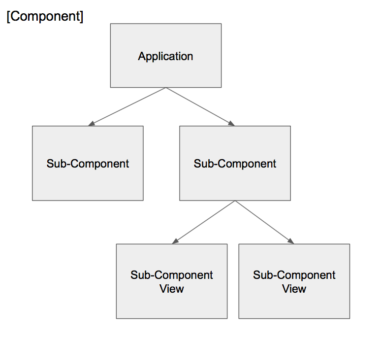

# The Component Pattern

The Component Pattern is a pattern I have identified in well structured systems. Software systems are a combination of structure, behavior, and state. Components define the structure of software systems. They are objects that have Actions, and Events. Components of a system are composed together in the pattern shown below. 
The goals are: 

 A system composed from components. Arrows pointing in represent action methods. Arrows pointing out represent events. Outer component reacts to events of inner components. This keeps dependencies pointing inward. With composition of calls made inward, and events outward, no inner component is dependent on an outer component. Because the dependencies flow in the direction of composition of the system , the dependencies are inherent in the system itself.

The pattern is for composing software from "Components". It is intentionally simple and abstract and doesn't require a library or a framework. It is just an idea.

There are two primary underlying principles: 
1. Software has three distinct axis: Structure, behavior, and state.
2. Programming is an art of organization. Good structure supports good organization.

The pattern asserts that an ideal system is composed as one hierarchy of components. 

## What is a component?

The simplest way to describe a component is that it's a box with N inputs and N outputs. 

What's the box for? 

1. It contains more boxes
2. It contains the state of the box
3. It contains the behavior of the box

This sounds like an object you say? Yes it does. But there are a few key differences. Remember when I said it's a box with N inputs, and N outputs? That is different than an object. An object has methods that return values to the caller. When you send input into a components input, some output comes out one of it's outputs. It has to, or there would be no reason to send it input in the first place.

It turns out (I believe) that methods that return values (and public properties) are bad for software composition. 

You know how (pure)functions compose really nice, and they can call other functions and they never get all tangled up in a knot? Well a pure function is a component. It's a component with one input and one output. It's the simplest form of a component. I am asserting that a function is just one form of something I am calling a component.

Components can be implemented as objects. Inputs can be methods, but the methods do not return values. 

* a component does not have methods that return values.
* a component does not have public properties (because that is actually a method that returns a value.

The outputs of a component can be implemented in different ways. (Observable, Callbacks, Delegates, Notifications) It doesn't matter how, it only matters that these messages are outputs. 

A good question to ask about your system is, is it one tree, or two trees? Is the UI a tree separate from the state tree?  What about the behavior tree? I believe it should be one tree of a Model, View, and Controller fractal. All three must compose, or you will always be fighting trying to get messages in and out of these trees.

This is why I see view controllers as sub-components. They are sub components of an application component.

###02/11/2016 

I was describing some rules for a UI design pattern and it occurred to me that these rules apply universally to the component pattern.

A component's responsibilities are: 

- Connect it's sub-components (often done when component starts)
- Listen to it's own inputs
- Send to it's sub-components inputs
- Listen to it's sub-components outputs
- Send to it's own outputs

By definition, a component owns it's sub-component's inputs and outputs. That said, what a component **doesn't do** is :
- listen to outputs it does not own.
- Sent to inputs it does not own.

Data should flowing in the direction of the components composition.

As stated before : 
> Because the dependencies flow in the direction of composition of the system , the dependencies are inherent in the system itself.
