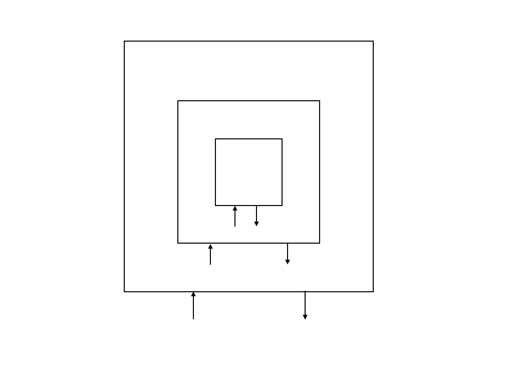
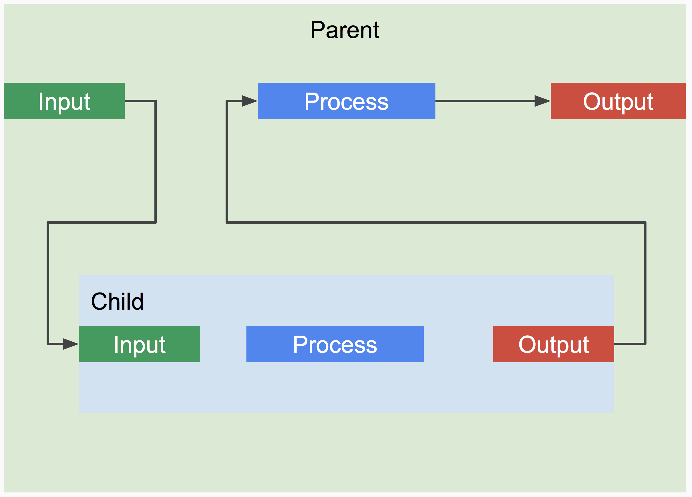
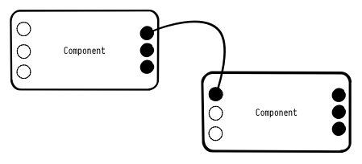
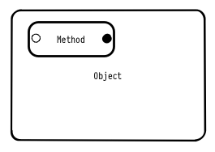
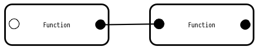

# The Component Pattern

The Component Pattern is a pattern in well structured systems. Software systems are a combination of structure, behavior, and state. Components define the structure of software systems. Components have inputs and outputs. Components of a system are composed together in the pattern shown below. The pattern is for composing software from "Components". It is intentionally simple and abstract and doesn't require a library or a framework. It is simply a pattern. How it is implemented is not specified.

 A system composed from components. Arrows pointing in represent inputs. Arrows pointing out represent outputs. Outer components called parents process output of inner child components. This keeps dependencies pointing inward. With composition of input made inward, and output outward, no inner component is dependent on an outer component until it is in the context of the system. Because the dependencies flow in the direction of composition of the system , the dependencies are inherent in the system itself.
 
 
##Composition

There are two primary underlying principles:
1. Software has three distinct axis: Structure, behavior, and state.
2. Programming is an art of organization. Good structure supports good organization.

The pattern asserts that an ideal system is composed as one hierarchy of components. 

1. There is no separate state tree.
2. Child components do not dispatch actions specific to the parent, they dispatch processed input, or perhaps no output at all.

## What is a component?
1. A component is any composable type that has inputs and outputs.
2. Child components are inherently dependent on facts provided by it's input.
3. Parent components are inherently interested in the facts provided by the output of it's children.
4. Whether or not a component has state is irrelevant to the rest of the system. What matters is the output. 

####Components vs. Objects

* a component does not have methods that return values.
* a component does not have public properties (because that is a method that returns a value.

#### Components vs. Functions
A function is a component with 1 input and 1 output. A component has N inputs, and N outputs.

---

###Notes:
###02/11/2016 

I was describing some rules for a UI design pattern and it occurred to me that these rules apply universally to the component pattern.

A component's responsibilities are: 

- Connect it's sub-components (often done when component starts)
- Listen to it's own inputs
- Send to it's sub-components inputs
- Listen to it's sub-components outputs
- Send to it's own outputs

By definition, a component owns it's sub-component's inputs and outputs. That said, what a component **doesn't do** is :
- listen to outputs it does not own.
- Sent to inputs it does not own.

Data should flowing in the direction of the components composition.

As stated before : 
> Because the dependencies flow in the direction of composition of the system , the dependencies are inherent in the system itself.
