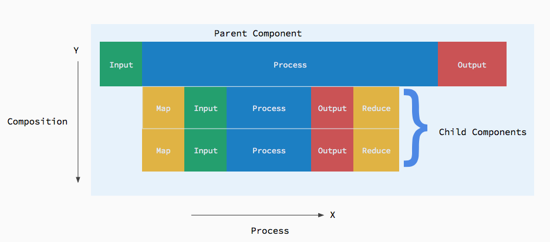

# The Component Pattern
 There are two primary underlying principles:

1. Software has three distinct axis: Structure, behavior, and state.
2. Programming is an art of organization. Good structure supports good organization.

The Component Pattern is a pattern to created well structured systems. Components define the structure of software systems. Components have inputs and outputs. Components of a system are composed together in the pattern shown in the diagram below.  This pattern is intentionally simple and abstract and doesn't require a library or a framework. 

The pattern asserts that an ideal system is composed as one hierarchy of components, starting with the application component.

## What is a component?
1. A component is any composable type that has input, a process, and output. (note: while a component may have multiple inputs and outputs, for reasoning purposes we consider the entire set of inputs and outputs as a whole.)
2. Child components are inherently dependent on facts provided input from it's parent.
3. Parent components are inherently interested in the facts provided by the output of it's child components.

 In the diagram above arrows pointing in represent input. Arrows pointing out represent output. Outer components are parents, that process output of inner child components. This keeps dependencies pointing inward. With composition of input made inward, and output outward, no inner component is dependent on an outer component until it is in a context. Because the dependencies flow in the direction of composition of the system , the dependencies are inherent in the context itself.
 

 

## Theory
Components are composed of subcomponents as shown above. A component receives input, some process happens, and it produces output at some point in time.  An entire application is a component that takes it's initial state, and produces new state. 

If we reason about this further, we can determine that any sub-component of the application is inherently dependent on the application state or the component wouldn't be necessary! In theory, all components in an application are a function of the same total state. AppState -> AppState.

It would not make sense to write every component specific to an application. Components do something specific and we want to re-use them. Therefore, we make components work with a specific state. But how do we bridge from the parent component's state to it's subcomponents specific state? 

In theory every subcomponent's input is a mapping of it's parent's state. And every subcomponent's output causes an update to it's parent. In the diagram above this is show in the yellow as Map, and Reduce.

Not all components require input or have output. But it's always in the context of it's parent  that makes their use interesting to the system.

Keep in mind, this is the theory behind the component pattern. How it is actually expressed or implemented is flexible.

---

## Notes

### May 29, 2016
This is a learning project for me.  I got these ideas from my own work, and then discovered others seemingly thinking about these ideas as well.  I have not seen anyone spell out an underlying pattern so I did. Whether or not it is correct or perfect, I don't know that either. Probably not. I throw ideas out as soon as I prove them wrong or I iterate on them. So far this has proven to be a useful pattern, but it's still evolving.

[Elm](http://elm-lang.org) is a very close implementation of this pattern. [Cycle.js](http://cycle.js.org) is another. [React/Redux](https://facebook.github.io/react/index.html) is also. However in my implementation of this pattern components are not just UI specific. Recently React added higher order components too.

Another interesting similar implementation of this pattern is [Flutter](https://flutter.io). 

The fact that I am seeing others evolve towards this tells me there might be something to it. 

### Feb 11, 2016

I was describing some rules for a UI design pattern and it occurred to me that these rules apply universally to the component pattern.

A component's responsibilities are: 

- Connect it's sub-components (often done when component starts)
- Listen to it's own inputs
- Send to it's sub-components inputs
- Listen to it's sub-components outputs
- Send to it's own outputs

By definition, a component owns it's sub-component's inputs and outputs. That said, what a component **doesn't do** is :
- listen to outputs it does not own.
- Sent to inputs it does not own.

Data should flowing in the direction of the components composition.

As stated before : 
> Because the dependencies flow in the direction of composition of the system , the dependencies are inherent in the system itself.

### 05/27/2016 [DRAFT]
### 3 Dimensional Data Flow in the X Y and Z axis.
We can think of the the component pattern in 3 dimensions. 

1. The Y axis represents composition and data flow from parent to child.
2. The X axis represents connection and processing on the primary thread. 
3. The Z axis represents asynchronous processing on a secondary thread, emanating from and back to the XY plane.

If a component needs to do asynchronous processing on another thread. The result comes back to the original plane, and output. For example fetching data:

1. Input comes in to request data.
2. The asynchronous process occurs in the Z axis, which is an output in that axis. ( a child component). Result or failure occurs in the Z axis. Result is output in the X axis.
