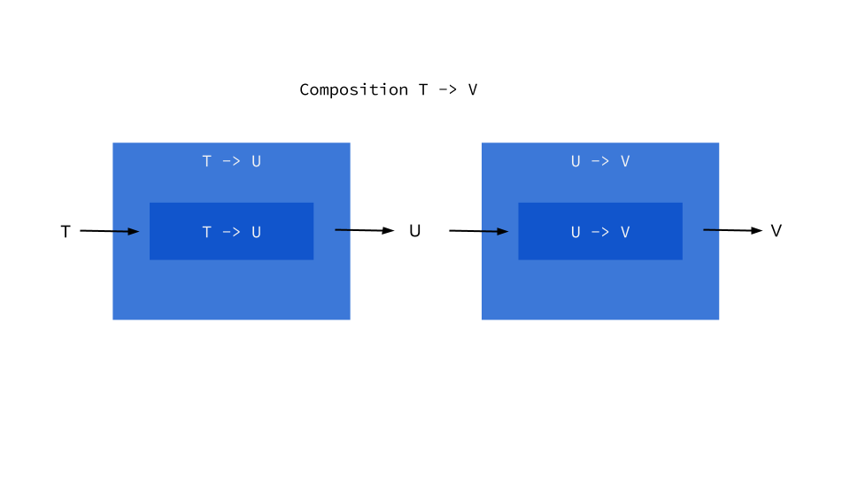
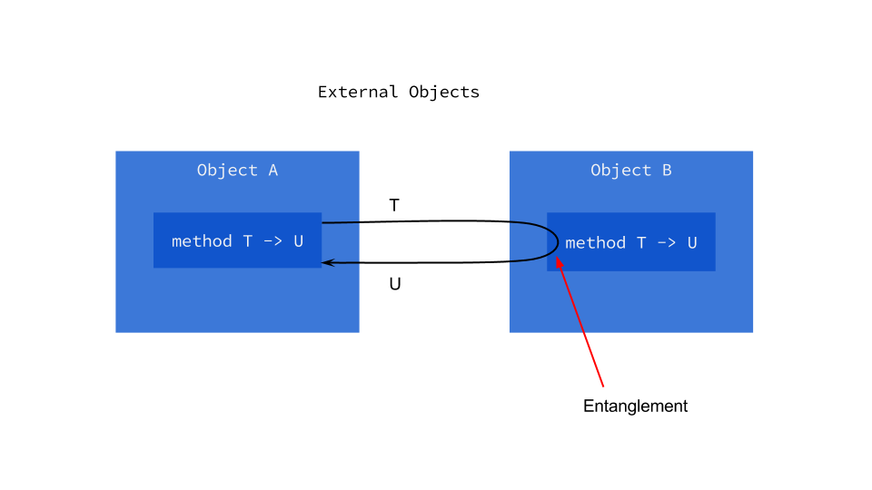

# Turning Objects into Functions

I've been pulling on this component oriented programming thread for some time. I've defined a pattern that I am sure creates a sound software compositional model.

At some point I realized that return values on methods are harmful to software structure.[^n] Let's make a few observations about composing functions, and composing objects: 

**Functions**:  

Functions message at the boundaries of composition. You can create pure functions such as `T -> U` below and compose them with the inner function `T -> U`, and create an outer composition such as `T -> V` by combining `T -> U` + `U -> V`. `T -> U` and `U -> V` will never become entangled. Outer `T -> U` and inner `T -> U` have a dependency, but that dependency is inherent in it's composition. For that reason, **this is not entanglement.**

**Objects/Methods**:

Objects compose at their boundaries, but message at the internal methods. When a method of an object calls another external object's method, and that method returns a value, that entangles the two objects. We would say that it is dependent on the object. It's dependent but it is not composed, so the dependency is not inherent in the composition. **This is entanglement**.

The only way to solve this is with something like the component pattern. Essentially creating a black box out of objects so they can compose.

The component pattern is stateless. Components only have events. Events can pass state to the next component, but there is no stored state. I have been trying to simplify the process of using the component pattern. I have been thinking about making all components have one event. An "Updated" event.

###Enter Redux
At first I did't understand why Redux prefers a state tree over a store tree. I did't see how you would get modularity from that.  But after listening to Dan Abramov's talk [here](https://t.co/oSpw0cjSBf), and watched him refactor a store into a function, then it hit me!

A reducer function is a component. It's a component that has actions because it takes an action as an argument. It's a component that has one event. It's return value. And who get's that return value? It's parent component. (function).

Redux is the component pattern, only it removes the clutter of objects. And because it is a function, composing is natural. You have to pass the current state in to the reducer along with it's action, but that is better than storing it. State is only a snapshot in time. So anywhere you record state is questionable.

Redux is a fresh look at software composition using functions. Composing your software as a set of reducer functions is an exciting idea. This is the first functional architecture pattern I have heard of, and I think it is very interesting.

But Redux lead me to other questions. Like, why make actions a separate element? I believe the benefit to that is the ability to capture the action stream for time travel / state recording.

Another question comes to mind. Why stop at a reducer? Why not just make the entire system pure functions?

Redux is essentially capturing a pattern I have started to recognize. It's the idea of internal "client/server". The idea that you make a request and you get a response. If you imagine the application as having a public API available on the imaginary "server".  The server responds back with state. This is the essential pattern here.

It's essentially turning the Application into a pure function. Very interesting indeed.

[^n]: This proposition applies to objects that represents a structural part of the system, not all objects in general. note: properties are also methods that return values

